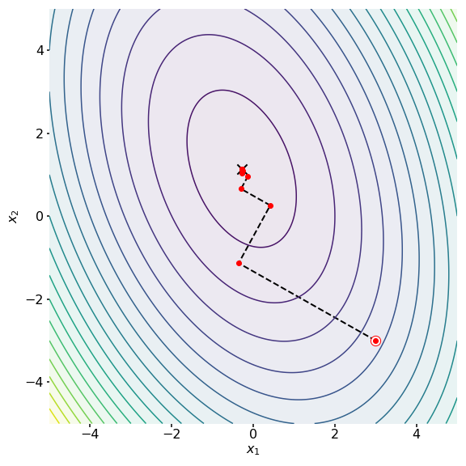

# Conjugate Gradient Method
## Building & Testing
```
make
```

```
make test
```
For OpenMP
```
make && OMP_NUM_THREADS=4 ./cg -r benchmark/cg_large_random.in
```
## Implementation
**Input**: 
- $A$ : Sparse matrix of the system
- $b$ : right-hand side
- $x_\ast$ : Approximated solution
- $x_\text{k}$ : Guessed solution at $k$ 
- $r_\text{k}$ : Residual at $k$ 
- $p_\text{k}$ : Search direction at $k$ 
- $\varepsilon$ : Convergence threshold
- $max\_iter$ :Maximum iterations

Where $Ax = b$ is a sparse, symmetric positive definite system such that:
- $A = A^T$ (Symmetric)
- $x^TAx > 0$ (Positive Definite Matrix)
	- All eigenvalues are > 0
	- $A$ is invertible 
	- There is a unique solution to $Ax = b$ for any $b$

**Initialize**:
   - Start with initial guess $x_\text{0}$
   - Compute initial residual as $r_0 = b - Ax_0$
   - Set initial search direction $p_0 = r_0$

**While** $k = < max\_iter$ **do**

   - Compute $Ap_k$
   - Compute $p_k^TAp_k$
   - Compute step size scalar $\alpha_k = \frac{r_k^Tr_k}{p_k^TAp_k}$
   - Update solution $x_{k+1} = x_k + \alpha_k p_k$
   - Compute new residual $r_{k+1} = r_k - \alpha_k Ap_k$
   - **If** $\|r_{k+1}\| < \varepsilon$, **then**
     - Set $x_{k+1} = x_\ast$
     - **Break**
   - Compute $\beta_{k+1} = \frac{r_{k+1}^Tr_{k+1}}{r_k^Tr_k}$
   - Update search direction $p_{k+1} = r_{k+1} + \beta_{k+1} p_k$

<p align="cenleftter">
  
</p>
